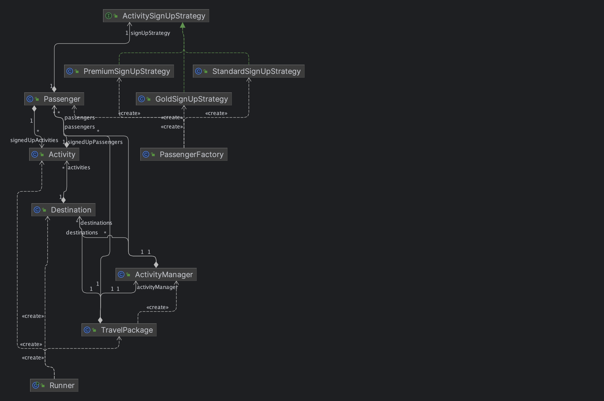
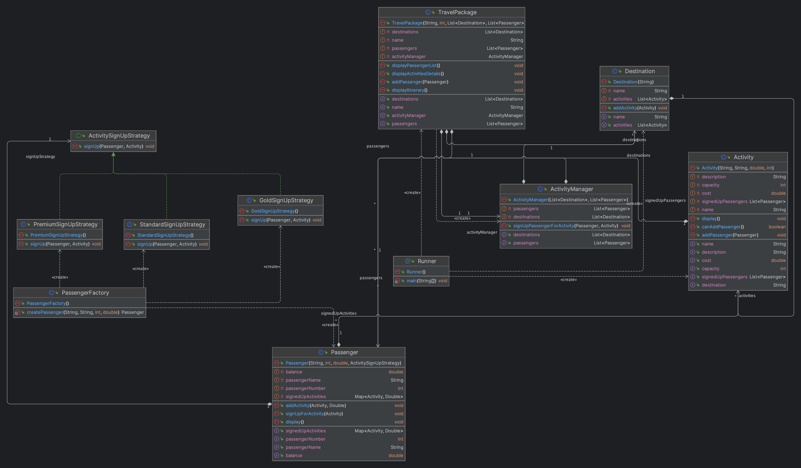

# Project Name

This project contains the implementation of Travel Package Manager.

## Java Documentation

Java documentation for this project is available [here](doc/index.html).

## Diagrams

### High-Level Diagram

This diagram illustrates the high-level interaction between different sub-blocks of the project.

### Lower-Level Class Diagram

This UML class diagram represents the structure and relationships between all the classes in the project.

